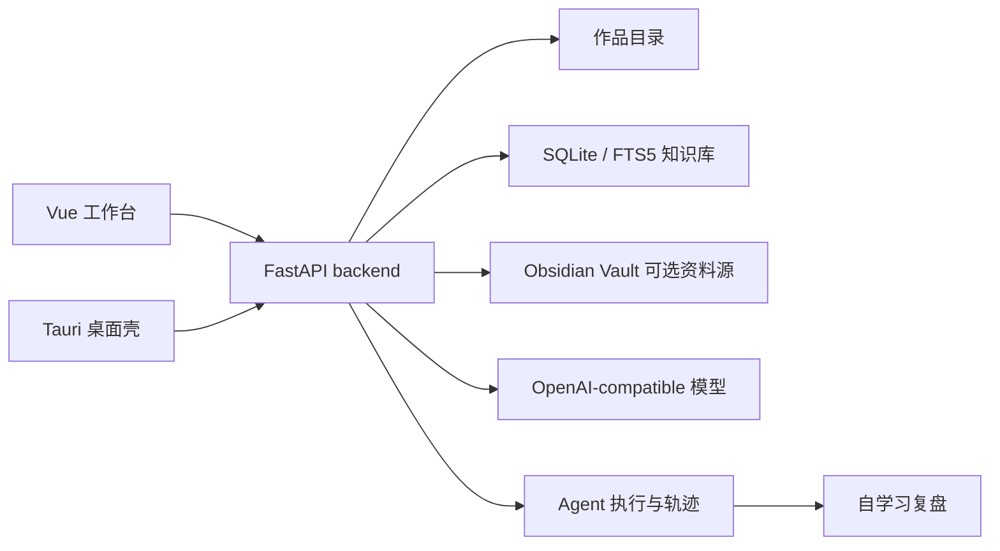

# 稿匣


面向长篇小说创作的本地优先桌面工作台。

`稿匣` 把作品文件夹、章节正文、设定资料、知识检索、模型生成、改稿技能和桌面打包流程放在同一个应用里。它适合需要长期维护世界观、人物线、章节上下文和参考资料的个人作者，也适合作为本地 AI 写作工具的二次开发底座。

[Release](https://github.com/mushroomfk/novel-generator/releases) · [文档索引](./docs/README.md) · [更新记录](./CHANGELOG.md) · [许可](./LICENSE)

## 桌面截图

### 写作工作台


### Agent 执行流程


### 技能库与知识检索


## 使用流程

1. 创建作品，设置章节数量、目标字数和基础设定；已有旧稿时，也可以从左侧“旧稿”入口导入已有小说，旧稿文件只支持 `.txt`，也可以直接粘贴正文。
2. 导入资料、人物卡、参考文本、网页、PDF；新作品会自动准备项目内 `Vault/` 长篇稳定档案，也可以在高级同步规则里改接已有 Obsidian Vault，后续在架构总览的“稳定档案”页签查看本章图谱、人物关系、图谱问题、维护建议并编辑档案；模型总览当前有效时，识别出的人物、事件、地点、道具、技能、场景或组织会自动进入项目内 Vault 正式档案。
3. 生成整书架构或章节蓝图，把故事方向沉淀为项目文件；架构总览里的关系、时间线和世界要素也可以整理回架构原文，修改后保存。
4. 选中目标章节，在 Agent 对话中提出续写、改稿、资料分析或架构调整请求；需要专心看稿时，可以隐藏 Agent 面板，在正文预览里直接编辑当前章节。
5. 审阅执行计划和生成结果，确认后写回章节正文。
6. 通过本地历史、项目记忆、Prompt 历史和知识检索继续迭代。
7. 换电脑或备份时从工作台右上角“更多”菜单导入或导出项目迁移包，在另一台设备继续写作。

## 相对常见 AI 写作工具的优势

| 维度 | 常见做法 | 稿匣 |
| --- | --- | --- |
| 数据位置 | 作品、资料和会话依赖云端项目 | 作品目录、章节、资料库、历史记录和知识索引默认保存在本机 |
| 长篇组织 | 以单次聊天或单篇正文为中心 | 以作品、章节、设定、资料、架构和连续性为中心 |
| 生成过程 | 直接返回一段文本，后续需要手工整理 | 生成前有计划，生成后可预览、审阅、写回和查看历史 |
| 资料使用 | 主要依赖复制粘贴上下文 | 支持导入多格式资料，使用 SQLite / FTS5、embedding 和 rerank 组合检索 |
| 可追踪性 | 难还原一次生成使用了哪些资料和步骤 | Agent 讨论、资料分析、章节写作、审校子任务和整书架构共用执行时间线，并保存 workflow 状态文件 |
| 二次开发 | 多数是封闭产品或插件 | 前端、backend、桌面壳和回归脚本都在仓库内，适合继续改造 |

## 为什么值得关注

- 本地优先：作品数据、知识库、版本记录和项目记忆默认保存在本地目录
- 面向长篇：围绕章节、设定、人物、资料、连续性和整书架构组织工作流
- 可审阅生成：模型输出进入计划、执行、预览、写回和本地历史，不只是一段聊天回复
- 受监督逐章生产：章节写回默认经过正文生成、小说专用去 AI 改稿、一致性复查和章节核验，作者确认后再进入项目正文
- 生成前可确认：主会话执行写正文或续写正文时，会在会话里先展示当前段提示词，作者可复制或修改后再生成本段；提示词只用于本次模型调用，不作为作品资料保存；小批量生成仍会先展示本章提示词，作者确认后再发起正文生成
- 资料可检索：导入文本、文档、网页、PDF 后建立 SQLite / FTS5 索引，并支持 embedding 与 rerank
- Agent 有轨迹：讨论、资料分析、章节写作、队列化审校和整书架构共用执行时间线；主对话可直接提交长文本，后端保存完整输入，超过 20000 字符的用户输入会先筛掉明显无关、技术日志或网页样板段落，再按约 50000 字符分段导入项目资料库，并把资料标题加入本轮引用；给路由、规划、讨论和技能整理模型看的上下文会自动压缩为摘要、原文头尾片段和资料引用，避免输入过大导致请求失败；执行中会在聊天流显示实时状态列表，按“已完成 / 正在运行 / 正在思考”展示步骤、耗时和摘要；完成后只保留结果说明、产物卡片和建议，不再展示计划卡、状态标签、执行步骤或 `event_blocks` 阶段摘要；执行状态、动作契约和子任务记录会写入项目目录；前端可按 `task_id` 读取 workflow 状态，停止长任务时会向后端写入中断请求，Agent 会在动作边界停止后续动作；内置技能目录记录对应的 Agent action、mode 和确认要求，规划器看到的技能清单与执行 action 保持一致，主对话快捷按钮也会把对应内置技能 ID 传给后端，让“续写本章”“判断本章”等入口按同一套 action 元数据生成计划；技能库可查看自学习候选、确认草案、写作回归、去 AI A/B、真实章节项目样本池、去 AI 裁判、去 AI 智能巡检、项目去 AI 自学习规则、模型审查、失败案例、系统学习版文风 / XP、剧情债务与人物弧线、技能版本、技能包和能力看板
- 可二次开发：前端、Python backend、Tauri 壳层和回归脚本都在仓库内

## 适合场景

- 写长篇、连载或系列作品，需要管理章节、设定、资料和版本
- 希望把 AI 写作放进可检查的生产流程
- 需要在本地保存 API Key、作品资料和知识索引
- 想研究或改造一个 `Tauri + Vue + FastAPI` 的本地 AI 应用

## 功能一览

| 模块 | 能力 |
| --- | --- |
| 作品管理 | 创建、重命名、删除作品，打开本地作品目录，导入已有小说，导出 / 导入项目迁移包 |
| 章节工作台 | 编辑正文、自动保存、本地历史、章节概览、章节写回和核验；Agent 对话旁的正文预览可隐藏对话面板，直接编辑当前章节并保存同步 |
| 故事架构 | 生成整书架构、分步架构、蓝图和项目设定文件；架构总览有长篇写作台账，可把人物、时间线、事件、地点、道具、技能、组织/势力维护回对应架构原文 |
| 资料库 | 导入 `txt / md / json / csv / html / docx / pdf`，PDF 可用 LiteParse 做本地增强解析并保留页码标记，建立本地索引；长篇稳定档案默认使用项目内 `Vault/`，可在架构总览查看本章图谱、人物关系、图谱问题和维护项，并编辑项目内 Markdown |
| 知识检索 | 关键词、embedding、rerank、作者参考库、Obsidian 图谱笔记、联网考据 |
| 写作技能 | 人物复刻、去 AI、文风参考、提示词预设、XP 预设、系统学习版文风 / XP、剧情债务与人物弧线、技能目录 Agent action 元数据、文件浏览、Agent 自学习 |
| Agent 执行 | 讨论、资料分析、受监督逐章生产、章节提示词确认与编辑、并行候选审校、可配置核验自动修订、整书架构、主对话快捷技能调度、workflow 状态、动作契约、执行轨迹、经验候选、自学习复盘、失败案例库 |
| 桌面运行 | Tauri 自动拉起本地 backend，并把实际 backend 地址下发给前端；退出时会先请求后端关闭，再结束 sidecar；macOS 启动时会清理同一 app 包内父进程已失效的旧 sidecar |
| 发布回归 | backend 单测、前端构建、浏览器 smoke、桌面 sidecar 和 `.app` 启动检查 |

## 技术方案

- 桌面壳：`Tauri 2` 负责窗口、应用元数据、桌面打包和 Python sidecar 拉起
- 前端：`Vue 3 + Vite + TypeScript` 提供作品列表、章节工作台、技能库、设置页和 Agent 对话
- 后端：`FastAPI` 负责项目文件、章节正文、资料导入、模型请求、技能流程和执行状态
- 本地数据：作品文件、章节、设定、长篇稳定档案配置和历史记录保存在作品目录；新作品会自动创建项目内 `Vault/`，包含 `Characters`、`Events`、`Locations`、`Props`、`Skills`、`Scenes`、`Organizations`、`Plans`、`ChapterNotes`、`Debts`、`CharacterArcs`、`Style`、`XP` 和 `Graph` 等目录，并默认写入 `.gaoxia/obsidian.json`；资料索引使用 `SQLite / FTS5`；旧稿接管会把粘贴文本或 `.txt` 旧稿文件拆成章节正文，写入 `.gaoxia/takeover/` 状态、原稿副本、拆章结果和接管报告，并把接续位置、上一章结尾、最近章节和写作边界写入 `core_seed.txt`、`plot_structure.txt`、`character_state.txt`、`blueprint.txt`、`global_summary.txt` 与 `checkpoint.json`，再刷新本地知识库；恢复接管时会保留已有非空章节正文，不用旧稿覆盖作者已改内容；前端会在读取前拒绝 30MB 以上旧稿文件；项目迁移包使用 `.gaoxia-project.zip` 保存完整作品目录并导入到当前工作区，前端导入入口在工作台右上角“更多”菜单；如果 Obsidian Vault 位于项目目录外，迁移包会保留项目内配置和章节学习状态，外部 Vault 的同步文件只保留配置、空统计和重新同步提示，不携带笔记列表、摘要或预览；包内 `narrative_state.json` 会移除 Obsidian 维护建议和动作，`.gaoxia/obsidian_drafts/` 维护草稿不会进入迁移包；包内 `project_distillation.json` 会移除外部 Obsidian 蒸馏条目并标记为需要重建；`.gaoxia/learning/*.json/.jsonl` 和其它 `.gaoxia` 状态里的外部 Obsidian 资料分析、自学习复盘、失败案例文本会改成迁移提示；Agent 线程和 `.gaoxia/runs/` workflow 状态会保留，但其中的 Obsidian 资料分析 artifact、维护 artifact、相关 trace / event、action / subtask 摘要会改成迁移提示，可重建的 `.gaoxia/thread_context/` 索引不会进入迁移包；打包用的 `knowledge.db` 副本也会移除外部 Obsidian 索引内容，导入后按当前环境重新建索引
- Obsidian 路径过滤：`include_patterns / exclude_patterns` 按大小写不敏感匹配；默认排除 `.obsidian/**`、`.trash/**` 和 `templates/**` 时，也会排除 `.OBSIDIAN/`、`.Trash/`、`Templates/` 等常见大小写写法；作者自定义 `drafts/**` 这类过滤规则时也能匹配 `Drafts/`；候选笔记超过 `max_notes` 时，会先按 Vault 相对路径稳定排序再应用数量上限，并在同步警告里提示有候选笔记未同步；候选总数和 `max_notes` 会进入来源签名，让界面的 skipped 和警告随 Vault 增删更新
- Agent 资料分析上下文：`review_knowledge` 继承目标章节时，不只读取资料库和章节安全的 Vault 笔记，也会读取该章的 `build_project_context_bundle()`，把章节任务卡、章节合同、Obsidian 待审软约束和项目学习版文风 / XP 放入资料分析提示；多章节任务切换到另一章时，会为新章节重新生成资料摘要
- 项目上下文预算：章节生成和资料分析默认使用约 18000 字项目上下文；写作模型配置容量较大时可提高到约 40000 字，但不会按模型宣传窗口塞满。超预算时按信息块分配容量，优先保留项目记忆、章节任务卡、章节合同、叙事状态、剧情债务、人物弧线、Obsidian 必写 / 禁写约束和当前章节状态，再处理正文片段、Vault 摘要和检索证据
- 章节提示词确认：`POST /api/studio/chapter-generate/prompt-preview` 和 `POST /api/generate/chapter-workflow/prompt-preview` 会在不调用写作模型的情况下返回完整 messages、可复制文本和可编辑正文提示词；作者确认后，编辑文本通过 `prompt_override` 或批量生成的 `prompt_overrides` 进入正文生成。生成结果仍会使用连续性合同、承接冲突检查、候选审校和自动修订链路。
- 主会话逐段写作：主会话里的写正文计划会创建 `.gaoxia/chapter_segment_sessions/` 分段会话，并在聊天流里显示当前段提示词。作者可复制或修改提示词，再生成本段；提示词只作为这一次写作模型调用的 `prompt_override`，不写入章节、资料库或会话历史。每段生成后进入可编辑正文框，作者可重新生成、润色，或接受并合并到当前章节；只有接受动作会写入章节正文，并继续触发现有章节保存后的知识索引、核验、叙事状态和稳定档案维护。作者在主会话说“重新第一章”“重写第 1 章”这类从头重写章节正文的要求时，也会进入同一个逐段提示词确认流程；第一段接受后会替换旧章节正文，后续段落再接续新稿。
- 章节连续性合同和项目记忆规则：章节生成、候选审校、章节核验和自动修订共用同一份连续性证据。生成第 50/80 章这类中段章节时，后端会把目标位置、人物状态、滚动摘要、蓝图锚点、近期章节尾段、叙事状态账本、剧情债务、人物弧线、Obsidian 约束和资料证据整理为合同；生成提示词会把合同视为优先约束，章节核验新增 `章节连续性合同` 维度，明确合同项缺失会计入自动修订触发条件，自动修订提示也会读取这份合同，默认最多修订 2 轮，已启用但仍保存为旧 1 轮的配置会在读取时升级为 2 轮。章节核验还会反查作者项目记忆里的“硬规则 / 警告”禁写表达，例如“不要提前揭示某人是主谋”“某人不能被提前揭示为主谋 / 真凶 / 卧底 / 潮师”“不要把 A 改名为 B”“铜钥匙不能被交给白石商会”“顾临不能死亡 / 叛变”或“林追不会主动暴露身份”，命中时在 `项目记忆规则` 维度记为 critical，并参与自动修订判断；改名类规则需要正文出现 A 被改成、写成或叫成 B 这类语境才算违规，B 正常出场不会单独触发；正文写成“没有暴露身份”“并不是主谋”“并不是卧底”或“没有把铜钥匙交给白石商会”这类否定状态表述时不算违规；作者修改项目记忆后，已有章节核验会标为过期，刷新后按新规则重新检查
- 章节核验界面：架构总览新增“章节核验”页签，会显示每章核验分数、状态、维度、问题、建议和过期标记；项目记忆规则命中项会在对应维度里直接展示，方便作者定位长篇人物、线索和情节连续性风险
- 世界架构维护：架构总览顶部有长篇写作台账，集中显示写作核心、人物与关系、情节与时间线、世界设定、章节蓝图和稳定档案；人物和技能维护到 `character_state.txt`，时间线、事件和场景维护到 `plot_structure.txt`，地点、道具和组织/势力维护到 `world_building.txt`
- 长篇稳定档案界面：架构总览新增“稳定档案”页签，会显示 Vault 同步状态、图谱解析数量、AI 维护摘要、维护建议和正式笔记；桌面写作图谱按当前章节展示可用档案节点，也可切到人物关系和图谱问题视角，点击节点查看关联、范围和问题。仍需人工确认的待审架构实体草稿会以“待审档案”节点进入写作图谱，作者可在节点详情里保存草稿或发布到 Vault。默认项目内 `Vault/` 的 Markdown 笔记可直接打开编辑，保存后会自动重新索引；章节保存、Obsidian 同步、章节上下文生成或稳定档案维护刷新后，项目内 `Vault/` 会自动发布系统生成且未被人工改动的中高优先级档案；普通读取项目详情不再触发 Vault 写入。进入稳定档案页签或执行维护刷新时，后端会按 Vault 文件变化刷新档案摘要；模型总览当前有效时，会把人物、事件、地点、道具、技能、场景和组织自动整理并发布为项目内 Vault 正式档案；模型总览过期时只展示旧结构，不写入草稿或 Vault；未发布的待审草稿在目标章节可见时仍会作为低优先级提醒进入章节上下文，但仍低于作者明确要求和正式 Vault 设定。自动刷新不会删除架构原文或清空关系总览，若模型总览来源过期，界面继续显示上次结构化总览并提示重新生成；项目目录外的 Vault 不自动写入，避免越过作品目录改作者的独立 Obsidian 库。
- 资料解析：PDF 导入在 `qwen-doc-turbo` 不可用或失败后，会优先尝试 LiteParse 本地解析并按页加入 `【第 N 页】` 标记；LiteParse 未安装、解析失败或无正文时回到 `pypdf`，只有本地文本为空时才尝试 LiteParse OCR，OCR 语言可用 `NOVEL_LITEPARSE_OCR_LANGUAGE` 配置
- 模型接入：使用 OpenAI-compatible `chat/completions`，可接入 OpenAI、DashScope、火山方舟等兼容服务；传输层会移除部分兼容服务容易拒收的可选采样参数，并对 SSL EOF、DNS 解析失败、远端中途断开、临时连接错误和可重试 5xx / 429 默认最多重试 5 次，等待间隔可用 `NOVEL_MODEL_RETRY_DELAYS` 调整
- 章节写作安全：架构总览的关系、事件和世界要素只读取 `.gaoxia/story_overview_model.json` 里的模型版全书总览；模型总览不可用、生成失败或结果没有通过证据校验时，界面会显示模型总览状态和错误，不会从本地架构文件抽取结构化节点。模型总览来源签名过期时，普通项目详情仍会显示上次结构化总览并标记为过期，避免稳定档案自动刷新后看板变空；章节生成、改稿、诊断上下文和项目级文风 / XP 提示不会读取模型总览缓存，项目记忆和续写 / 改稿类项目蒸馏包也不会从模型总览里的全书实体反写；没有目标章节时，续写、改稿、仿写和人物任务默认不带入 Obsidian 后段笔记，整书架构任务仍可使用全书资料，避免后段设定通过总览缓存或蒸馏报告进入早期章节
- 检索增强：关键词检索、embedding、rerank、Obsidian 图谱笔记和联网考据可组合使用，适配资料库和作者参考库；Obsidian 会解析 `summary / description / abstract / keywords / search_terms / 关键词` 等摘要 / 检索词 Properties、正文内联属性 `summary:: / keywords::`，也支持 Dataview 常见的 `[summary:: ...]`、`(keywords:: ...)` 段落内写法；双链、Markdown 内链、反向链接、未解析链接、歧义链接、必须包含和禁止出现短语都会参与同步，这些短语既可以写在 frontmatter，也可以写成正文里的“必须出现：…”、“禁止出现：…”、同名小节或 `required_phrases:: / forbidden_phrases::` 内联属性；frontmatter 字段名支持大小写、空格、连字符和下划线等常见属性写法，frontmatter 或正文内联属性里的 `source_notes / related_characters / related_notes / depends_on / foreshadows / payoffs / reveals / related_locations / related_props / related_organizations` 等关系字段会参与图谱解析，并把依赖、伏笔、兑现、揭示、相关地点等关系语义保留到知识索引、章节上下文和界面预览；Canvas file 节点关系进入章节上下文时，会优先显示目标笔记标题和可见来源笔记标题，而不是原始文件路径；章节上下文只展示目标章节可见的关系目标，当前笔记正文或摘要里指向未来笔记的 `[[双链]]` 或 Markdown 内链会改写为“未开放设定”，真正未解析或歧义的双链仍作为图谱风险提示，避免早期章节通过关系标题、正文链接或 Markdown 链接路径看到后段笔记；笔记还可声明 `chapter_range / chapter_start / chapter_end / reveal_after_chapter`、正文里的“适用章节”“第几章后可用”、`chapter_range:: / reveal_after_chapter::` 内联属性，开放范围可写成 `chapter_range: 58+`、`chapter_range:: 第59章以后`，或 Obsidian 正文 / 属性标签 `#章节/58-60`、`#第58章`、`#第58章起`、`#Ch58-60`、`#Ch58+`、`#适用章节／40～42`、`#剧透/57`、`#剧透／39`、`#第57章后可用`，用于控制当前章节能否引用；写作上下文会按当前任务、目标章节、当前章和上一章尾段带入相关笔记及一跳关联，选笔记时会把标题、路径、别名、标签、双链、Markdown 内链、摘要、关键词、章节范围、必需 / 禁止短语和中文词组重合度一起纳入匹配，明确绑定目标章节的笔记会提高选择优先级，并把命中笔记整理为本章 Obsidian 设定检查清单；相关笔记里的必需 / 禁止短语会提升为本章 Obsidian 写作约束；普通知识检索、Agent 资料分析、任务蒸馏、连续性证据包和章节核验都会按目标章节过滤未来 Obsidian 设定，知识检索预览、连续性证据正文和反向关联也会按目标章节处理；有目标章节时，知识检索和证据检索会先读取更大的候选池再按章节过滤，章节上下文触发的知识检索也会传入目标章节，Obsidian 检索命中如果无法对应到当前总览里的可见笔记，会被丢弃，避免未来笔记或旧索引通过图谱摘要进入早期章节，也避免后段笔记太多时把当前章节可用资料挤出结果；技能库、架构总览和联网考据会把当前选中章节传给后端，有选中章节时只显示或引用该章节安全预览，联网考据提示也会标明目标章节；若 `review_knowledge` 后面紧跟章节生成、改稿或一致性检查，它会继承后续章节作为 Obsidian 过滤范围，并按任务说明和目标章节优先读取当前章绑定笔记；若后面是整书架构，则保持全书资料视角；叙事状态账本会把目标章节可见的 Obsidian 来源、必写项、禁写项、图谱风险和本章执行状态并入章节任务卡，记录哪些必写项已满足、哪些仍缺失、哪些禁写项已触犯；未完成或触犯的 Obsidian 要求会转成后续章节可见的高优先级叙事债务，修订满足后关闭；长篇稳定档案可用时，账本还会根据未入 Vault 的剧情债务、人物弧线和图谱问题生成维护建议，给出建议笔记路径和带来源 ID、来源章节、相关人物字段、人物双链或来源笔记路径的 Markdown 草稿；剧情债务和人物草稿会按来源章节写入 `reveal_after_chapter`，多个来源章节时按最晚来源章开放，发布后按目标章节过滤，不会把后段自动维护笔记带入早期章节；这些建议会进入 Agent 规划上下文，路由 / 规划给模型看的建议明细也会按目标章节筛选；多章节指令会优先按生成、改稿、拆场或诊断的动作目标章节判断，不会简单使用句子里的第一个章节号；没有明确目标章节的非架构任务只保留维护摘要，不暴露后段建议标题、路径或动作；Agent 路由 / 规划和自学习状态以维护刷新模式读取当前项目详情时，会用最新 Obsidian 摘要刷新维护建议，并可自动写入中高优先级待审草稿；重复出现的未解析双链会生成 `Graph/` 待审草稿，草稿会继承来源笔记的章节范围和剧透边界；若来源章节范围不连续，或多个开放式来源起点不同，会改用较晚可见的剧透边界，不合成过宽章节范围；重名和歧义链接会生成修复提醒；已解析双链如果来源笔记可见范围没有被目标笔记可见范围覆盖，会形成章节范围不匹配风险；带未解析或歧义双链的笔记不会被计入孤立笔记；中高优先级建议会在章节保存、Obsidian 同步或章节上下文生成时自动写入项目 `.gaoxia/obsidian_drafts/` 待审草稿，用户仍可显式保存或更新草稿；自动草稿未被人工改动时，后续图谱来源列表、来源内容或章节边界变化会更新草稿里的 `source_notes` 和范围字段，人工改动过的草稿不会被自动覆盖；保存草稿遇到同路径既有人工内容时也会保留原文并记录状态；项目内 `Vault/` 会在章节保存、Obsidian 同步、章节上下文生成或稳定档案维护刷新后自动发布系统生成且未被人工改动的中高优先级维护项；普通读取项目详情不再触发 Vault 写入；项目目录外 Vault、人工改动草稿、合并项、缺失项和低优先级规则仍需要用户显式发布或确认，目标路径必须在 Vault 内且不会覆盖已有笔记，发布后会重新同步 Obsidian 摘要和 `knowledge.db`，新笔记里的人物双链、Markdown 内链、图谱草稿别名和 frontmatter 来源关系会进入已解析 / 未解析链接统计，并按继承的章节边界控制可见范围；模型叙事编辑在生成下一章合同时会读取当前章和下一章的 Obsidian 约束；章节核验会反查当前章节可用的相关 Obsidian 笔记，正文触犯禁止短语时给出风险项，正文提到笔记、连续性证据命中笔记，或少量连续章节范围明确绑定的笔记缺少必需短语时给出警告；这些必写 / 禁写问题会计入自动修订触发条件；重复命名不会被强行解析到任意笔记；Vault 文件变化会通过来源签名触发同步摘要刷新，章节核验使用目标章节可见的 Obsidian 签名，未来章节专用笔记变化不会让早期章节核验过期
- Obsidian 章节计划类层级标签范围：`#章节计划/58`、`#章节合同/58-60`、`#场景卡/59`、`#scene-plan/59` 这类标签会同时参与类型推断和章节范围解析；不需要再额外维护 `chapter_range`。普通 `#人物/主角`、`#剧情债务/伏笔` 仍只按类型或关系语义处理，不会被当成章节范围。
- Obsidian 考据来源会继续进入长篇生产链路。目标章节可见笔记里的 `external_references` 会写入叙事状态账本章节任务卡，出现在模型叙事编辑提示、Agent 路由 / 规划能力上下文、自学习面板最新章节任务卡和任务蒸馏材料备注中；项目蒸馏签名也会记录 `external_references / external_links`，考据来源变化后会刷新对应蒸馏资料，让章节计划、资料考据和写作执行使用同一批来源说明。
- Obsidian Properties 数组和分隔符：`aliases: ["潮师, 守账人"]`、`required_phrases: ["潮声异常, 不得提前解释"]` 这类 YAML flow sequence 会保留引号里的逗号，不会误拆成多条别名或约束；普通列表型 Properties 和正文内联属性里的 `keywords:: A, B`、`source_notes: 当前线索；未建笔记` 仍会按逗号、顿号、半角分号和中文分号分成多个检索词、关系目标或写作约束。
- Obsidian 多行 Properties：`summary: >`、`description: |`、`summary: >2-`、`keywords: |2-` 这类 YAML block scalar 会进入知识索引、笔记选择和章节安全预览；多行 `keywords / source_notes / required_phrases` 等列表型字段会按行进入检索词、图谱关系和写作约束；这些列表字段的单项也可以写成 `- >` 或 `- |`，用于维护较长的检索词、来源笔记、必写项或禁写项。
- Obsidian 目录和标签类型推断：笔记没有显式 `type / kind / 类型` 时，系统会按 `Characters/`、`Locations/`、`Plans/`、`Debts/`、`CharacterArcs/`、`Style/`、`XP/` 等常见目录或标签推断人物、地点、章节计划、剧情债务、人物弧线、文风规则和 XP 规则；`#人物/主角`、正文 `#人物／主角`、`#章节计划/58`、`#剧情债务/伏笔` 这类层级标签会按半角或全角斜杠分段参与推断；作者已写 type 时以作者字段为准，Obsidian 多选 Properties 里的 `type: [主角, 人物]`、`type: [临时, 章节计划]` 会扫描整个列表并识别系统已知类型，完全未知的显式 type 会保留原值。
- Obsidian AI 可见性 Properties 和标签：`usable_by_ai / ai_usable / AI可用 / 可供AI使用 / 可供模型使用 / 写作可用` 或 `#AI可用` 为真时会被视为明确允许；`no_ai / not_for_ai / exclude_from_ai / AI不可用 / 不供AI使用 / 不允许AI使用 / 勿用AI`、`#no-ai` 或 `#AI不可用` 为真时会排除笔记；`no_ai: false` 或 `AI不可用: 否` 会被视为明确允许。Markdown frontmatter、正文内联属性、正文标签、HTML details 正文内联属性 / 标签和 Canvas 文本节点属性都按这套规则过滤；HTML details 正文声明不可用于 AI 或声明过滤状态时，只排除该折叠块；Canvas 会按节点处理 AI 可见性，单个 `no_ai:: true` 或 `#AI不可用` 文本节点只会排除该节点，不会让同一张画布里的公开节点失效。
- Obsidian 状态别名、布尔状态 Properties、标签和目录：显式 `status / 状态` 字段支持别名归一，`status: 正式设定 / official / final` 会按正式可用状态参与过滤，`status: wip / archived` 会按过滤状态处理；笔记没有显式状态字段时，`canonical: true / published: yes` 或正文 `canonical:: true` 会按正式可用状态处理，`draft: true / private: true / archived: true` 或正文 `draft:: true` 会按过滤状态处理，Canvas 文本节点同样支持这些布尔状态属性；缺少显式状态和布尔状态时，`#canonical / #正式 / #已发布` 或 `正式设定/`、`Published/` 等标签 / 目录会按正式可用状态参与过滤，`#draft / #草稿 / #private / #私密 / #废案` 或 `Drafts/`、`草稿/`、`Private/` 等标签 / 目录会按过滤状态处理；显式 `status` 字段优先，不被布尔属性、标签或目录覆盖。
- Obsidian 文风 / XP Properties：`style_rule / voice_rule / tone_rule / sentence_rhythm / imagery / dialogue_rule / avoid_style / examples / applies_to` 和 `xp_rule / precheck / postcheck / workflow / technique / avoid_xp` 等字段会转成文风 / XP 参考内容；作者不用把规则再写成正文段落，目标章节提示也能读取句式节奏、意象、对白、禁用写法、检查项和示例。
- Obsidian 章节档案 Properties：`chapter_note / chapter_summary / chapter_archive / author_archive` 笔记只维护 `chapter_title / chapter_summary / chapter_events / state_changes / handoff_to_next / chapter_excerpt`，或系统生成章节档案草稿时写入 `chapter_index / chapter_title / chapter_summary / handoff_to_next / chapter_excerpt / obsidian_required_satisfied / obsidian_required_missing / obsidian_forbidden_violations`，这些字段也会转成知识索引、章节上下文、Agent 能力上下文和叙事状态账本里的“Obsidian 章节档案”提示；作者不用把章节回顾再写成正文段落，后续章节仍能读取本章摘要、关键事件、状态变化和交接提醒，Agent 规划目标章节时也能提前看到可见章节档案的交接信息；章节核验会检查明确指向当前章的强制类 `handoff_to_next`，正文没有承接可核验关键词时会作为 Obsidian 必需设定问题进入自动修订判定；系统自动草稿里的“下一章关注本章后果”类交接只进入上下文，不触发自动修订。
- Obsidian 章节合同 Properties：`chapter_contract / chapter_plan / scene_plan` 笔记里的 `objective / required_beats / debts_to_advance / debts_to_protect / character_checks / style_checks / forbidden_moves / acceptance_checks / evidence_sources / risk_notes` 会转成章节计划行；作者不用把同一份合同再写成正文小节，目标章节提示也能读取目标、节拍、禁写动作和验收项，`evidence_sources` 会形成图谱关系。
- Obsidian YAML 对象列表和顶层嵌套对象：章节计划、章节合同、剧情债务和人物弧线笔记可以把 `scenes / required_beats / character_checks / debts_to_advance` 写成 `- goal: ...`、`conflict: ...`、`payoff: ...` 这类多字段对象，也可以写成单独 `-` 后换行维护 `goal / conflict / payoff`，或用 `required_beats: [{goal: ..., evidence_sources: [{source_note: ...}]}]`、`- {goal: ..., payoff: ...}` 这类 YAML flow mapping；对象字段值可以用 `goal: >`、`reason: |` 这类 YAML block scalar 维护多行场景目标、理由或验收说明；对象里继续嵌套 `character_checks / evidence_sources` 等对象列表时也会递归解析，嵌套列表同样支持单独 `-` 后换行写对象字段。作者也可以把合同字段包在 `chapter_contract:` 这类顶层对象下，例如在其中维护 `chapter_range / objective / required_beats / acceptance_checks / evidence_sources`，同步会保留分组并读取这些直接子字段。同步后会保留对象字段名和值，把它们转成章节上下文可读的结构化行，对象里的双链和 Markdown 内链仍会进入链接、反向链接和图谱关系统计，并继续按目标章节隐藏未来笔记。
- Obsidian 待审草稿解析：项目内 `.gaoxia/obsidian_drafts/` 的待审草稿会复用正式 Vault 笔记同一套 frontmatter 解析；作者手工把章节合同、文风规则或人物状态草稿改成 `required_beats: [{goal: ...}]`、`- {action: ...}`、`objective: >`、多行 `tags:` 或带行尾注释的 YAML 时，章节范围过滤、合同 / 文风短预览和 Agent 上下文仍会读取真实草稿内容，不会退回成只支持简单 `key: value`。
- Obsidian 剧情债务 / 人物弧线 Properties：`narrative_debt / plot_debt` 笔记只维护 `debt_content / debt_status / risk_level / expected_payoff_range / next_required_action / related_characters`，或 `character_arc / character_state` 笔记只维护 `character / phase / current_state / unresolved_pressure / required_next_check` 时，知识索引、叙事状态账本、章节任务卡、Agent 规划上下文和模型叙事编辑都能读取这些结构化字段；系统生成的剧情债务草稿也会写入债务 Properties，人物状态草稿会写入人物状态 Properties 并带 `人物状态` 标签，发布后可直接成为 Vault 正式来源。
- Obsidian 元数据章节安全：目标章节上下文会对 `tags / aliases / keywords / required_phrases / forbidden_phrases` 里的 Obsidian 双链、Markdown 内链和已知未来笔记的纯文本标题 / 路径名 / 文件名使用同一套章节安全改写；这些字段指向或提到未来笔记时会显示为“未开放设定”，不会在标签预览、“本章 Obsidian 写作约束”、检索预览或证据正文里提前暴露后段标题。
- Obsidian frontmatter 注释：`status: canonical # 正式设定`、`chapter_range: 58-60 # 中段` 这类行尾 YAML 注释不会进入状态、章节范围、图谱关系或写作约束；引号里的 `#` 和双链 heading 会保留。
- Obsidian 标签 Properties 和正文标签：`tags: "#人物 #第58章 #剧透/57"`、`tags: #章节/44-45 #剧透/43`、多行 `tags: - #人物/配角`、`tags: 人物 主角`、`tags: "人物；第58章"`、`tags:: #支线 #第59章`、正文 `#人物／主角 #适用章节／40～42 #剧透／39` 这类空格、分号、未加引号井号标签或正文标签写法会按单个标签解析；标签前导 `#` 会去掉后参与标签展示、类型推断、章节范围和剧透边界识别。普通 frontmatter 字段仍按 YAML 行尾注释规则处理。
- Obsidian 关系字段 Markdown 内链：`source_notes: "[当前线索](Clues/当前线索.md)"`、`related_characters:: [林追](../Characters/林追.md)`、`[林追](/Characters/林追.md)` 这类写法会保留“来源笔记 / 相关人物”等关系语义，并按笔记路径、同目录相对路径或 Vault 根路径解析可解析链接和反向链接；关系字段写到 `#小节` 或 `^block` 时，小节 / 块引用会进入“关系小节”上下文和知识检索，内部 links / backlinks 仍按笔记文件记录，指向未来笔记的小节名会按章节隐藏。
- Obsidian 关系字段逗号拆分：`source_notes: "[线索乙, 潮账](../Clues/线索乙.md)"`、`related_characters: ["[林追, 主角](../Characters/林追.md)"]`、`depends_on: "[[线索甲|账册, 初证]]"` 这类普通字符串或列表项会保留链接标签、双链别名和目标路径里的逗号，不会把一个关系目标拆坏。
- Obsidian 正文内联关系字段：`[source_notes:: [当前线索, 潮标](当前线索.md)]`、`(related_characters:: [林追, 主角](林追.md))`、`depends_on:: [[线索甲|账册, 初证]]` 这类 Obsidian / Dataview 内联属性会保留嵌套链接和双链别名里的逗号，并生成关系语义、可解析链接和反向链接。
- Obsidian 可见 callout 任务列表：普通 `note / info` callout 里的 `> - [ ] status:: canonical`、`> - [!] source_notes:: [[当前线索]]`、`> - [?] required_phrases:: 潮声异常`，以及 `> ## 必须包含`、`> ## 禁止出现` 下的任务项，会按正文内联属性、图谱关系和写作约束解析；`[!] / [?] / [>] / [/] / [-]` 这类常见 Obsidian Tasks 状态也会识别，隐藏 callout 里的同类内容仍不会进入 AI 可见正文。
- Obsidian Markdown 表格：Markdown 笔记、Canvas 文本节点和可见 callout 里的章节计划、章节合同、剧情债务、人物弧线表格，如果列名匹配 `章节目标 / 必须节拍 / 禁写动作 / 验收项 / 证据来源 / 相关人物` 等字段，会自动转成章节上下文可读的结构化行；单元格里的 `\|` 会还原为普通 `|`，避免验收项或节拍内容带着 Markdown 转义符进入提示；表格里的 `[[双链]]` 和 Markdown 内链仍会生成图谱关系，指向未来笔记时按章节安全内容隐藏。
- Obsidian Markdown 内链括号文件名：`[林追旧档](../Characters/林追(旧).md)` 这类目标路径里的英文括号会作为文件名内容解析，不会被提前截断；如果目标是未来笔记，章节安全内容仍会隐藏对应链接和别名。
- Obsidian Markdown 内链转义和标题：`[林追旧档](../Characters/林追\(旧\).md "旧档")` 会还原为 `Characters/林追(旧).md`；`[终局答案](../Secrets/未来真相 "终局")` 这类无扩展名目标会去掉 Markdown title 再解析，指向未来笔记时仍按章节安全内容隐藏。
- Obsidian Markdown 引用式链接：正文里的 `[林追旧档][old]`、`[林追旧档]`、`[old]: ../Characters/林追\(旧\).md "旧档"` 和 `[林追旧档]: ../Characters/林追\(旧\).md "旧档"` 会生成可解析链接、反向链接和关系语义；`[终局答案][future]` 或 `[终局答案]` 指向未来笔记时，引用定义里的路径和 title 也会按章节安全内容隐藏；Markdown 脚注 `[^id]: ...`、脚注缩进续行和正文脚注标记不会作为知识图谱链接解析，也不会进入 AI 可见正文。
- Obsidian HTML 链接：`<a href="../Characters/林追.md">林追</a>` 会按 Markdown 内链进入图谱，生成可解析链接和反向链接；指向未来笔记的 `<a href="../Secrets/未来真相.md">终局答案</a>` 会按章节安全内容隐藏标签和路径，指向本地 PDF / 图片 / 音频等附件的 `<a href="资料/访谈.pdf">访谈</a>` 会被当作附件过滤。
- Obsidian URI 链接：`obsidian://open?vault=Demo&file=Characters%2F林追.md`、`obsidian://advanced-uri?vault=Demo&filepath=Secrets%2F未来真相.md&heading=终局答案` 这类内部 URI 会按 Vault 根路径解析；`file / filepath / filename / path` 指向目标笔记，`heading / header / section / block / blockid / block_id` 或 URI fragment 会保留为小节 / 块引用。关系字段、Markdown 链接、HTML `<a>` 链接和 Canvas link 节点里的 URI 都会生成图谱关系和反向链接，指向未来笔记时仍按章节安全内容隐藏。
- Obsidian 相对路径双链：`[[../Characters/林追]]`、`[[./当前线索]]`、`[[Clues/../Characters/林追]]`、`[[/Characters/林追]]` 这类 Vault 内相对路径或根路径会按来源笔记路径和路径段归一化，生成可解析链接、反向链接和关系语义；如果相对双链指向目标章节不可见的未来笔记，章节安全内容、检索预览和证据正文仍会隐藏未来标题和别名。
- Obsidian URL 编码双链：`[[Characters/林%20追]]`、`[[../Secrets/未来%20真相]]` 这类目标会先解码再参与路径归一化、图谱解析和章节安全处理；指向未来笔记时仍会隐藏未来标题、路径和别名。
- Obsidian URL 编码保留字符：`[[Characters/林%23追]]`、`[线索](Secrets/未来%5E真相.md)` 这类文件名里的编码字符会作为路径内容保留，不会被误当成 heading、query 或 block 分隔符；章节安全处理仍按解码后的真实目标判断。
- Obsidian 越界相对链接隔离：根目录笔记里的 `[[../Outside/旧设定]]`、`[[Clues/../../Outside/旧设定]]`、`[[/../Outside/旧设定]]` 或 `[外部](/../Outside/旧设定.md)` 不会进入图谱链接、未解析链接或维护建议；子目录内正常回到 Vault 内部的相对路径仍会解析。
- Obsidian 块引用：`[[当前线索^block-id]]`、`[[当前线索#小节^block-id]]` 这类块引用会按对应笔记解析为图谱链接和反向链接；如果块引用指向目标章节不可见的未来笔记，章节安全内容仍会改写为“未开放设定”。
- Obsidian 同笔记内部链接：`[[当前线索#内部索引]]`、`[[当前线索^scene-a]]`、`[回看](当前线索.md#内部索引)` 这类目标仍是当前笔记的链接不会生成跨笔记图谱链接、反向链接或关系语义，避免目录、heading 和 block 导航污染图谱统计。
- Obsidian 图谱风险章节安全：目标章节安全记录会保留不涉及未来笔记的未解析双链和可见范围内的歧义双链，让章节上下文继续提示需要整理的 Vault 链接；歧义名称如果同时命中后段不可见笔记，则不会在早期章节显示。
- Obsidian 关系小节：Markdown 和 Canvas 文本里的 `## 来源笔记`、`## 相关人物`、`## 伏笔`、`## 兑现` 等小节列表，以及 `相关地点：[[旧码头]]` 这类关系行，会转成图谱关系、可解析链接和反向链接；目标章节不可见的关系目标仍会在章节安全内容里隐藏。
- Obsidian 私密区隔离：Markdown 和 Canvas 文本里的 `%%...%%` 注释、Markdown HTML 注释 `<!-- ... -->`、fenced code block、inline code、Markdown 删除线、HTML 删除标签和隐藏 HTML details 不参与正文内联属性、双链、标签、关系小节、必写 / 禁写、章节范围、检索预览和章节上下文解析；作者可把未确认想法、模板、废弃设定或未来剧透放在这些区域，系统不会把它们当作可引用设定。
- Obsidian 隐藏 Callout：`> [!spoiler]`、`> [!future]`、`> [!private]`、`> [!hidden]`、`> [!draft]`、`> [!todo]`、`> [!no-ai]` 以及 `> [!剧透]`、`> [!未来]`、`> [!隐藏]`、`> [!私密]`、`> [!草稿]`、`> [!待定]`、`> [!勿用]`、`> [!不引用]` 这类 callout 会从 AI 可见正文中排除，不进入图谱关系、检索预览、章节上下文或必写 / 禁写解析；同一引用块内后续 `> [!note]` 仍视为隐藏内容，结束引用块后重新开始的普通 `> [!note]`、`> [!info]` 才按正文处理；普通 callout 里嵌套的隐藏 callout 只排除嵌套块，外层公开内容仍按正文处理。
- Obsidian 隐藏 HTML details：`<details>` 的 `summary` 或属性带 `spoiler / future / private / hidden / draft / todo / no-ai`，或带 `剧透 / 未来 / 隐藏 / 私密 / 草稿 / 待定 / 勿用 / 不引用` 时，整段折叠内容会从 AI 可见正文中排除；折叠正文里写 `no_ai:: true`、`AI不可用:: 是`、`#no-ai`、`#AI不可用`、`draft:: true`、`private:: true`、`archived:: true` 或过滤状态时，也只排除该折叠块；普通 `<details><summary>公开资料</summary>...</details>` 里的正文仍会参与资料解析。
- Obsidian 附件链接过滤：`![[当前线索]]`、`![[关系图.canvas]]` 这类笔记嵌入仍会作为知识关系处理，并进入 `embedded_links`；章节上下文会把目标章节可见的嵌入笔记显示为短预览，方便章节计划、场景卡或合同嵌入直接参与写作提示。`![[旧地图.png]]`、`![[访谈.pdf]]`、Markdown 图片、HTML 媒体标签、`[访谈PDF](资料/访谈.pdf)` 和 `[访谈PDF][ref]` / `[ref]: 资料/访谈.pdf` 这类本地附件链接不会进入图谱关系、未解析链接、反向链接、检索预览或章节上下文；指向未来笔记的嵌入目标不会在早期章节预览里显示。
- Obsidian 外部考据链接：Markdown 笔记和 Canvas 会把 HTTP(S) 考据入口写入 `external_links`，并把 Markdown 链接标题、HTML `<a>` 文本、Canvas link 标签和结构化来源名写入 `external_references`，包括 `source_url / source_urls / reference_links / research_links / external_links / references / sources / citations / url / 资料链接 / 资料来源 / 参考链接 / 参考资料 / 考据链接 / 考据来源` 等 Properties、正文内联属性、Markdown 外部链接、引用式链接定义、裸 URL、HTML `<a>` 和 Canvas link 节点 URL；同步面板会统计考据链接数量，技能库和架构总览的 Obsidian 笔记卡片、章节上下文优先显示“考据来源”。这些外部 URL 不会写入 Vault 内部 `links / backlinks / graph_relations`，也不会生成未解析链接维护建议；本地附件链接仍会被排除。
- Obsidian Canvas：默认同步 `**/*.canvas`；Canvas 文本节点可用 `title / 标题 / name / 名称` 声明笔记标题，覆盖画布文件名并进入同步摘要、知识检索和章节上下文；Canvas link 节点的 HTTP(S) URL 会作为外部考据入口进入 Canvas 正文、知识检索和章节上下文，但不会写入 Vault 内部 links / backlinks；Canvas link 节点的 `obsidian://open` / `obsidian://advanced-uri` URL 会作为 Vault 内部链接进入可解析链接、反向链接和图谱关系，并在正文里显示为 Canvas 内部链接节点；没有 `label / text` 的内部 URI link 节点会用目标笔记名作为 Canvas 边关系标签；Canvas file 节点会进入可解析链接和反向链接，`../Clues/当前线索.md` 这类相对 file 路径会按 Canvas 所在路径归一化，file 节点的 `subpath` 或文件路径里的 `#小节` 会进入 Canvas 正文和章节安全上下文，但内部 links / backlinks 仍按笔记文件记录，不把小节当成新笔记；Canvas 边会保留为图谱关系，Canvas group 分组会按画布坐标识别内部节点，分组标题和分组内 file 节点关系会进入图谱关系和章节上下文；画布文本里的“适用章节”“必须出现”等约束也会参与章节上下文。带 `no_ai:: true`、`#no-ai`、`AI不可用:: 是`、`draft:: true` 或状态不允许的 Canvas 文本 / group 节点会按节点排除，隐藏 group 内部节点也会排除；`no_ai:: false` 这类明确可用声明不会误删公开节点；同一张画布里的公开节点仍会同步。指向未来笔记的 Canvas file 节点、小节、边、分组关系、link 标签、Canvas 内部链接节点和边标签在早期章节安全内容里会隐藏或改为中性提示；边或分组指向当前可见笔记但关系标签提到未来笔记名时，图谱关系标签也会按章节安全内容改写，避免关系图提前暴露后段设定。
- Obsidian 章节范围推断：Markdown 和 Canvas 会从 `#第58章`、`#第58-60章`、`#第58章起`、`#Ch58-60`、`#Ch58+`、正文 `#适用章节／40～42`、`#剧透／39`、`#第57章后可用` 这类标签，以及 `chapter_range: 58+`、`chapter_range:: 第59章以后`、`source_ids: [chapter-058]`、`source_ids: [ch058, Chap 060]`、`source_chapters: [58, 60]`、`章节来源: [第58章, 第60章]`、正文里的 `来源章节：第 58 章、第 60 章`、`来源章：第 58 章、第 60 章`、`第58章-线索.md`、`第59-60章-后续.md`、`Chapters/58/设定.md`、`chapter-61.canvas` 这类属性、正文来源、文件名或路径识别章节标记；`source_ids` 里的章节来源 ID 支持 `chapter-058 / chap-058 / ch058 / Chapter 58`，但不会把 `archive-ch058` 这类普通 ID 当作章节；`source_chapters` 字段名支持 `章节来源 / 来源章 / 来源章节号` 等别名；解析出的 `source_chapters` 会进入 `ObsidianNoteSummary`、知识内容头部、技能库长篇稳定档案笔记卡片和架构总览 Obsidian 笔记卡片，供界面、上下文和后续维护逻辑使用；显式章节范围优先，文件名 / 路径与来源 ID、来源章节冲突时按更晚的开放章节处理；章节档案带 `source_ids` 或 `source_chapters` 时，`第058章-回顾.md` 这类单章文件名不会把它限制成只在第 58 章可见，后续章节仍可读取；没有 frontmatter 时也会按目标章节过滤，减少作者维护章节属性的负担。
- Obsidian 证据检索安全：章节化知识检索和证据检索会先从 `knowledge.db` 读取更大的候选池，再替换成目标章节安全内容；如果查询词只命中被隐藏的未来标题、双链、Markdown 内链、Canvas file subpath 或已知未来笔记纯文本标签，或安全内容只剩弱相关短词重合，系统会丢弃这条命中，不让无效命中污染知识预览或连续性证据包。
- Obsidian 章节范围分隔符：正文标签、标签 Properties 和文件名 / 路径里的区间分隔符支持半角连字符、波浪线、中文全角波浪线、长横线和“至 / 到”，例如 `#第58～60章`、`#Ch58～60`、`#适用章节／40～42`、`第58～60章-计划.md` 和 `ch58～60-plan.md` 会按对应章节范围过滤。
- Obsidian 剧透边界排序：只有 `reveal_after_chapter`、`#剧透/57` 或 `#第57章后可用` 的笔记，在目标章节开放后也会作为章节相关资料优先参与选择；章节档案和后段设定不会因为没有显式 `chapter_range` 而被无关全局资料挤出上下文。
- Obsidian 文风 / XP 笔记：Vault 中 `type: style_rule / xp_rule`，或放在 `Style/`、`XP/`、`文风/`、`写作规则/` 等目录，或带 `文风 / 风格规则 / XP / 写作经验` 标签的正式笔记，会在目标章节可见时进入项目级文风 / XP 提示，也会进入 Agent 路由 / 规划上下文；作者只在 Properties 里维护文风规则、句式节奏、意象、对白、禁用写法、示例、XP 规则、生成前后检查、推进方法和禁用做法时，提示构建会读取同步后的结构化正文，让这些字段直接进入提示，不依赖摘要或短预览截断。可见规则超过提示容量时，会优先保留目标章节范围最贴近的规则，并在容量允许时保留文风和 XP 各自最相关条目，避免大 Vault 里的通用规则把本章专属规则挤出提示。这些内容优先级低于作者明确要求、手工文风和手工 XP，也不会写入 `.gaoxia/learning/style_xp_evolution.json`；没有目标章节时也会从同步记录读取无章节边界的全局规则，并排除带章节范围或剧透边界的后段规则，避免后段审美规则提前影响早期章节。系统学习版文风 / XP 规则在至少两个章节重复出现且没有匹配到 Vault 规则笔记时，会生成 `Style/` 或 `XP/` 低优先级待审维护草稿，草稿带来源规则、来源章节、按最晚来源章生成的剧透边界和 `source_ids`，并把规则内容写入 `style_rule` 或 `xp_rule` Properties；未发布前会在目标章节待审草稿提醒、讨论入口的章节化 `brainstorm` 上下文和 Agent 规划上下文里显示非正式文风 / XP 预览，摘取规则、适用范围、检查项、证据数和置信度；作者发布后才成为 Vault 正式规则，并按章节边界进入后续提示。发布后的规则笔记如果保留 `source_ids`，作者改名、移动或重写规则表达后，也不会重复生成同一条维护建议。
- Obsidian 章节计划笔记：Vault 中 `type: chapter_plan / scene_plan / chapter_contract`，或放在 `Plans/`、`Scenes/`、`章节计划/`、`场景卡/` 等目录，或带 `章节计划 / 章节大纲 / 场景卡 / 节拍表` 标签的正式笔记，会在目标章节明确且章节范围很窄时进入“叙事状态账本”的 `Obsidian 章节计划`，并进入模型叙事编辑的下一章合同输入；第 70 章计划不会出现在第 58 章提示里。模型叙事编辑生成的下一章章节合同如果没有匹配到可用 Vault 计划或合同笔记，会进入维护队列，生成 `Plans/第058章-章节合同-...md` 这类中优先级待审草稿；草稿带 `type: chapter_contract`、`chapter_range`、来源章节、`source_ids` 和 `gaoxia_maintenance_id`，未发布前会在目标章节的待审草稿提醒里显示非正式合同预览，摘取章节目标、必须节拍、禁止动作和验收项，作者发布后才作为 Vault 正式章节计划进入目标章节提示，已匹配的合同不会重复生成维护建议；发布后的合同笔记保留 `gaoxia_maintenance_id` 或 `source_ids` 时，作者改写合同正文仍按同一合同识别；已发布的 `chapter_contract` 会按“章节目标、必须完成的节拍、必须推进的债务、不能提前揭开的债务、人物检查、文风检查、禁止动作、验收项”等小节或同名 Properties 读取，避免只截到合同开头而漏掉后半段检查项。
- Obsidian 剧情债务 / 人物弧线笔记：Vault 中 `type: narrative_debt / plot_debt / character_arc / character_state`，或放在 `Debts/`、`PlotDebts/`、`CharacterArcs/`、`剧情债务/`、`人物弧线/` 等目录，或带 `剧情债务 / 叙事债务 / 人物弧线 / 人物状态` 标签的正式笔记，会按目标章节可见范围进入叙事状态账本；生成第 58 章前可直接看到第 58-64 章可用的债务和人物状态，Agent 路由 / 规划上下文也会读取目标章节可见的 Obsidian 来源、章节计划、必写项、禁写项、剧情债务、人物弧线和图谱风险；保存章节后这些笔记会成为 `.gaoxia/learning/narrative_state.json` 的债务或人物弧线来源，也会写入章节任务卡并显示在自学习面板的最新章节任务卡里；模型叙事编辑生成下一章合同时也会读取下一章可见的这些条目。作者只在 Properties 里维护债务内容、处理状态、风险等级、预计处理区间、下一步动作、相关人物，或维护人物、阶段、当前状态、未解压力和后续检查项时，这些字段也会进入知识索引和账本。系统自动生成的剧情债务草稿会写入 `debt_content / debt_status / risk_level / next_required_action`，人物状态草稿会写入 `character / phase / current_state / unresolved_pressure / required_next_check` 并带 `人物状态` 标签；发布后的剧情债务和人物状态笔记带 `source_ids`，作者改名、移动或改写标题后，只要保留来源 ID，就不会重复生成同一条维护建议。
- Agent 多章节目标：Agent 路由 / 规划会识别“第 58 到 60 章”“第 58 章到第 60 章”这类章节范围，也会把“先检查第一章，再生成第二章”里的生成、改稿、拆场或诊断目标放在前面；包含“蓝图 / 架构”等词但明确写了章节范围时，也会优先读取目标章节 Obsidian 任务，而不是直接进入全书视角；能力上下文会展开前 3 个目标章节的 Obsidian 任务摘要，包含来源、章节计划、章节档案、必写项、禁写项、剧情债务、人物弧线和图谱风险，维护建议也会按这些目标章节一起筛选和排序；明确要求生成正文的 2 到 3 章范围会展开成逐章生成动作，每章再进入去 AI 和一致性复查，超过 3 章会提示分批或先整理章节蓝图；执行阶段跨到下一章时，会按新目标章刷新资料库和 Obsidian 分析摘要，避免后续章节复用上一章的资料结论。
- Obsidian 章节档案草稿：长篇稳定档案可用后，已保存章节如果没有匹配到可用章节档案，叙事状态账本会生成 `ChapterNotes/第058章-标题.md` 这类待审草稿，草稿包含章节摘要、来源章节、相关人物、命中的地点 / 道具 / 组织、Obsidian 执行状态、下一章交接和正文摘录，并写入 `chapter_index / chapter_title / chapter_summary / handoff_to_next / chapter_excerpt / obsidian_required_satisfied / obsidian_required_missing / obsidian_forbidden_violations`、`source_ids`、`source_chapter_hash`、`source_notes`、`related_locations / related_props / related_organizations` 与 `reveal_after_chapter`；`source_notes` 会合并本章命中的 Vault 笔记、章节计划、剧情债务和人物弧线来源，但不会引用其它章节档案；正文会列出本章 Obsidian 章节计划、剧情债务、人物弧线和下一章交接，方便发布后在 Vault 图谱里追溯本章写作依据；项目内 `Vault/` 会在章节保存后自动发布符合条件的系统章节档案；项目目录外 Vault 或人工改动草稿仍需作者显式发布后才进入 Vault，后续章节可检索引用，早期章节不会提前看到。未发布前，目标章节可见的 `create_chapter_note` 待审草稿会在章节上下文和 Agent 规划上下文里显示短预览，包含 `chapter_summary / handoff_to_next / obsidian_required_missing`，让后续章节先获得上一章摘要、交接和未完成必写项；作者手工删除 frontmatter 但保留“章节摘要 / 下一章交接 / 未完成的 Obsidian 必写项 / 章节正文摘录”正文小节时，短预览会从正文小节读取；提示仍标明不能当作 Vault 正式设定引用，人物、剧情债务和图谱等其它待审草稿不会显示这种章节档案预览。
- Obsidian 章节档案刷新：未被人工改动的自动章节档案草稿会在章节正文变化后刷新；章节标题变化时会迁移到新的 `ChapterNotes/` 文件名并移除旧自动草稿。作者改过的草稿会保留原文件和人工状态，不被自动覆盖。自动发布过的章节档案在章节正文或标题变化后会进入 Vault 待更新状态，且不会把已发布的章节档案当成本章来源笔记引用自己。同步器会读取 `source_chapter_hash`，即使本地维护动作记录缺失，也能识别由系统生成但对应旧正文的章节档案；发布后的章节档案如果保留 `source_ids`、`source_chapters` 或正文“来源章节”，作者改名、移动、改写标题或放到自己的 Archive 目录后，系统仍会按来源章节控制可见范围，把来源章节保存在摘要元数据里，并识别为同一章档案；作者把类型改成 `author_archive` 并删除 `source_ids` 时，只要保留 `source_chapters`，维护队列仍按同一章档案处理。
- 待审草稿：章节生成、改稿和诊断上下文会按目标章节显示 Obsidian 待审草稿提醒，帮助模型知道资料库还有整理项；进入章节上下文和 Agent 规划上下文时，系统会按来源章节与目标章节的相关性排序，并显示来源章节；带章节范围或剧透边界的草稿（包括作者手工改动后的草稿文件）不会进入范围外章节提示，草稿 frontmatter 字段名也支持大小写、空格、连字符和下划线等常见属性写法，这些提醒也会明确标注不能当作 Vault 正式设定引用。目标章节可见的 `create_chapter_note` 草稿会额外显示“草稿预览”，只摘取章节摘要、下一章交接和未完成 Obsidian 必写项，避免作者尚未发布章节档案时后续章节完全失去承接信息；frontmatter 缺失时，会读取同名正文小节和“章节正文摘录”小节作为摘要来源。目标章节可见的 `create_chapter_contract_note` 草稿会显示“合同预览”，只摘取章节目标、必须节拍、禁写动作和验收项；frontmatter 缺失时读取合同正文小节，仍不会当作 Vault 正式计划。目标章节可见的 `create_style_rule_note` / `create_xp_rule_note` 草稿会显示“文风预览”或“XP预览”，只摘取规则、适用范围、检查项、证据数和置信度；frontmatter 缺失时读取正文里的“文风规则 / XP规则 / 使用建议”等行。目标章节可见的 `create_story_*` 架构实体草稿会显示人物、地点、道具、组织、事件、技能或场景档案摘要。除了维护状态提醒，目标章节可见的章节档案 / 章节合同 / 文风 / XP / 架构实体待审草稿还会进入单独的“Obsidian 待审软约束”区，只作为低优先级补充提示，优先级始终低于作者明确要求和正式 Vault 设定；讨论入口的章节化 `brainstorm` 也会复用同一套章节安全提醒和软约束，不再只看手工拼接的摘要块。提示渲染会逐条读取对应草稿文件，并校验维护 ID / 类型，避免一条维护建议误用其它草稿正文。草稿或维护建议只保留 `source_chapters` / 正文“来源章节”、没有显式 `chapter_range` 或 `reveal_after_chapter` 时，Agent 上下文按最晚来源章节开放，避免第 59 章看到含第 60 章来源的维护项。Graph 待审草稿如果来自 `chapter_range: 58+` 与 `chapter_range: 60+` 这类开放起点不同的来源笔记，会改用较晚开放章前一章的 `reveal_after_chapter`，不会生成从第 58 章起可见的草稿。同一路径的维护建议即使因来源变化产生新 ID，也会沿用已有草稿状态；叙事状态账本会保存维护摘要，统计待处理、高优先级、自动草稿、草稿缺失、Vault 笔记缺失、Vault 笔记已移动、Vault 待更新和已忽略数量，并进入 Agent 规划上下文；规划目标章节明确时，Agent 会按该章节可见维护项重算摘要并筛选建议，避免后段维护压力影响当前章；维护队列按 80 章长篇规模保留章节档案建议和操作记录，一次自动保存更多中高优先级草稿；自学习面板会显示完整维护列表，可按状态筛选并按标题、路径、章节或动作搜索，也可把当前筛选结果批量保存为项目内待审草稿，把当前筛选结果里已保存的草稿显式批量发布到 Vault，批量确认当前筛选结果里的 Vault 合并项，批量忽略当前筛选结果里暂不处理的维护建议，或批量恢复当前筛选结果里的已忽略建议，同时区分自动草稿、人工改动草稿、保留人工草稿、草稿缺失、Vault 笔记缺失、Vault 笔记已移动、Vault 笔记待更新和已忽略；作者可忽略暂不处理的建议，也可恢复处理让同路径后续建议重新进入待处理和自动草稿流程；保存草稿遇到同路径人工内容时会提示已保留原文，草稿文件被移动或删除后可重新保存，发布过的 Vault 笔记被移动或改名后会先按内容签名识别；新生成的维护笔记带 `gaoxia_maintenance_id`，发布到 Vault 前也会恢复缺失的身份字段，内容被作者改过但身份唯一匹配时也会自动改到新路径；没有唯一匹配或文件被删除时可重新发布；Vault 待更新项保存新版草稿时会额外生成合并草稿，标出正式 Vault 笔记和系统建议路径，把 Vault 正文和系统新版草稿放在同一份对照文件里；作者在 Obsidian 完成合并后可在面板单条或按当前筛选结果批量确认，系统会记录当前 Vault 内容并刷新 Obsidian 摘要和 `knowledge.db`；批量保存本身只写项目 `.gaoxia/obsidian_drafts/`；项目内 Vault 的自动发布仍按后端条件执行，批量发布只处理已保存草稿，仍检查目标路径在 Vault 内且不覆盖已有笔记；批量确认只记录已人工合并后的 Vault 当前内容；批量忽略不会删除草稿或 Vault 笔记，批量恢复只改变维护建议状态
- 待审草稿章节标签：章节生成提示读取项目 `.gaoxia/obsidian_drafts/` 中真实草稿文件的 frontmatter；作者手工加入 `tags: [第58章起, 剧透/57]`、`tags: [Ch58+]` 或多行 `tags:` 列表时，会按正式 Obsidian 笔记相同的标签章节范围和剧透边界过滤，不会把待审草稿提前提示给早期章节。
- 待审草稿缺失保护：项目 `.gaoxia/obsidian_drafts/` 中的草稿文件被移动或删除后，章节生成上下文仍会读取维护项里的 `source_chapters` / 正文“来源章节”作为可见边界；含第 58 章和第 60 章来源的缺失草稿不会出现在第 59 章提示里，第 60 章才会显示草稿缺失和建议路径。
- 自学习维护摘要：Agent 自学习面板没有筛选时显示后端全局 Obsidian 维护摘要；存在状态、来源章节、搜索或产物 ID 筛选时，会按可见维护项重新统计摘要。Agent 结果区 `obsidian_maintenance` 产物打开第 N 章维护队列后，会按来源章节和产物 `metadata.suggestion_ids` 定位对应维护项，并提供“清除产物筛选”按钮；摘要总数与列表显示数一致，避免按章节处理维护项时仍看到全书统计。
- Obsidian 状态同步：自学习面板保存 Obsidian 配置、读取作品详情或进入架构总览稳定档案页签时，后端会按 Vault 文件变化自动刷新档案摘要，让新增 Vault 笔记触发的图谱风险、维护摘要和章节任务卡进入面板；保存草稿、发布到 Vault、确认 Vault 合并、忽略或恢复维护建议后，维护接口也会返回最新自学习状态，前端优先用响应里的状态更新维护摘要和章节任务卡，并重新读取作品详情；发布和确认合并还会刷新 Obsidian 同步状态。维护动作已成功但自学习状态或作品详情刷新失败时，界面会保留成功提示并附带失败原因。
- 自学习动作状态同步：候选状态更新、草案状态更新、草案应用、技能维护、写作回归、模型审查、排程设置和排程执行接口会在 `meta.self_evolution` 返回最新自学习状态；前端优先使用响应状态更新候选、草案、趋势、失败案例、Obsidian 维护摘要和章节任务卡，响应缺少状态时才重新读取自学习状态。
- 待审草稿正文来源保护：作者手工改动待审草稿并删除 frontmatter 时，只要正文仍保留 `来源章节：第 58 章、第 60 章` 或 `source_chapters:: 58, 60` 这类来源章节行，章节生成上下文仍按最晚来源章节过滤，不会把后段来源草稿提前提示给早期章节。
- 剧情债务草稿会把预计处理区间写成 `expected_payoff_range`，而不是 Obsidian 可见范围 `chapter_range`；发布后的债务笔记从来源章节后可见，中间章节能继续保护这条线，预计兑现窗口只作为计划信息给作者和 Agent 参考
- 孤立笔记整理：两篇以上没有正文双链、frontmatter 关系、未解析或歧义双链和反向链接的正式 Obsidian 笔记会生成 `Graph/孤立笔记整理-{来源摘要}.md` 待审索引草稿；作者发布后，索引笔记会用 `source_notes` 和正文双链连接原笔记，让这些设定进入 backlinks 和后续图谱检索；后续新增孤立笔记会使用新的来源摘要路径，不会被旧索引的已发布状态隐藏
- 执行链路：Agent 计划、执行、子任务进度、批量章节队列、结果和错误状态通过 backend 统一管理，前端以流式状态展示；每次执行会在 `.gaoxia/runs/{task_id}/workflow.json` 记录预检、动作契约、心跳、产物校验和子任务文件；章节保存后会维护 `.gaoxia/learning/style_xp_evolution.json` 和 `.gaoxia/learning/narrative_state.json`，把重复出现的文风 / XP 信号、剧情债务、人物弧线、章节任务卡、模型叙事审查、章节合同、Obsidian 维护建议和维护摘要带入后续生成；章节保存响应会带回最新 `self_evolution` 元数据，技能库保存生成章或改稿章后会立即更新自学习面板里的章节任务卡和 Obsidian 维护摘要；技能库写回章节时会把当前选中的 XP 预设传给后端，让 XP 学习记录使用作者实际选择；章节任务卡会携带目标章节可见的 Obsidian 来源、必写项、禁写项、剧情债务、人物弧线、图谱风险和执行状态，并在自学习面板最新章节任务卡中展示；Agent 章节生成、draft 写回或改稿写回后，如果当前保存生成或更新了 Obsidian 维护草稿，会在执行结果里返回 `obsidian_maintenance` 产物，列出相关待审草稿和路径，产物卡片可直接打开自学习面板并按来源章节和产物 `metadata.suggestion_ids` 定位对应维护项，避免长篇里章节号文本搜索误命中其它章节；任务结束后记录技能使用、调用规则候选、写作评价和失败案例，技能库提供自学习查看、候选确认、写作回归、模型审查、排程配置、后台排程、技能版本回滚、技能包迁移和全局技能提升入口
- 发布验证：仓库保留 backend 单测、前端构建、浏览器 smoke、desktop sidecar、Tauri 打包和 `.app` 启动检查脚本



## 项目状态

当前是公开预览版。

- 已可本地运行前端、Python backend 和 Tauri 桌面壳
- 已验证 macOS arm64 桌面链路、测试分发流程和 Windows x64 CI 安装包构建；当前对外 macOS 验证脚本默认使用 release 产物
- 当前测试版版本号为 0.1.4；macOS arm64 测试包已生成并通过 SHA256 与 DMG 校验；Windows x64 测试包已由 GitHub Actions `Windows Desktop Release` run `27495837771` 生成并通过本地 SHA256 校验，Windows 实机安装、卸载、首次启动和安装后 GUI 操作仍待人工验收
- 后端单测覆盖项目服务、生成服务、资料导入、许可证、技能流程和记忆系统
- 浏览器层 UI smoke 覆盖建作品、写章节、Agent 计划执行、整书架构和技能检索主链路
- 正式分发仍需要补充 Developer ID 签名、公证、安装包渠道和版本升级策略

## 快速开始

环境要求：

- `Node.js 20+`
- `npm 10+`
- `Python 3.12`
- macOS 桌面打包建议安装 Xcode Command Line Tools
- Windows 桌面打包建议使用 GitHub Actions 的 `Windows Desktop Release` 工作流；本机打包需要 Rust MSVC 工具链和 Visual Studio Build Tools

安装依赖：

```bash
npm run deps:install
python3.12 -m venv .venv
. .venv/bin/activate
pip install -e backend
```

启动开发环境：

```bash
npm run dev:all
```

默认地址：

- 前端：`http://127.0.0.1:1420`
- backend：`http://127.0.0.1:18181`
- 健康检查：`http://127.0.0.1:18181/api/app/health`

也可以分开启动：

```bash
npm run backend:dev
npm run dev
```

如果前端不是默认来源，可以设置 `NOVEL_CORS_ORIGINS`；支持 JSON 数组，也支持逗号分隔：

```bash
NOVEL_CORS_ORIGINS="http://localhost:1420,http://127.0.0.1:1420" npm run backend:dev
```

## 配置模型

复制环境变量示例：

```bash
cp .env.example .env
```

模型调用走 OpenAI-compatible `chat/completions`。设置页只要求填写服务商、模型、接口地址和 API Key；篇幅能力、输出容量和采样类参数由系统处理，实际 `chat/completions` 请求会移除 `temperature / top_p`，避免部分模型拒收可选采样项。API Key 可在应用设置里保存，也可以通过环境变量提供：

- `NOVEL_MODEL_API_KEY`
- `NOVEL_API_KEY`
- `DASHSCOPE_API_KEY`
- `ARK_API_KEY`
- `OPENAI_API_KEY`

Embedding 检索默认使用随 sidecar 打包的本地 `BAAI/bge-small-zh-v1.5`，通过 `fastembed` 和 ONNX Runtime 直接加载，安装后不需要用户再下载模型或填写 Embedding API Key。设置页不再显示 Embedding 配置入口，保存写作设置后的自动检测会使用内置本地模型。旧配置或直接调用后端 API 传入 OpenAI-compatible `/embeddings` 配置时，仍可读取这些环境变量：

- `NOVEL_EMBEDDING_API_KEY`
- `DASHSCOPE_API_KEY`
- `ARK_API_KEY`
- `NOVEL_API_KEY`
- `OPENAI_API_KEY`
- `NOVEL_LOCAL_EMBEDDING_CACHE_DIR`：仅用于排障或开发，覆盖内置本地模型目录；正式打包默认读取 sidecar 内置模型。

设置页高级区的“运行调度”控制本机模型请求节奏。默认主模型并发为 1、检索并发为 1，后台模型任务只在前台空闲后执行；章节候选模式默认 `standard`，也可以改为 `fast` 或 `deep`。

第二审查模型用于模型审查、章节核验和模型版故事总览。章节核验和故事总览会优先使用第二审查模型；第二审查模型不可用时，改用当前写作模型。关系总览优先读取模型版故事总览缓存；没有可用缓存或模型总览生成失败时，会显示模型总览状态和错误，不会从本地架构文件抽取人物、事件或世界要素。设置页高级区可保存第二审查模型，也可以用环境变量覆盖：

- `NOVEL_REVIEW_MODEL_API_KEY`
- `NOVEL_REVIEW_MODEL_BASE_URL`
- `NOVEL_REVIEW_MODEL_NAME`

辅助任务后台巡检用于刷新知识库索引、模型版故事总览、系统记忆和去 AI 智能巡检。默认开启，默认间隔 180 秒；当前台模型或检索任务忙时，后台巡检会延后到后续巡检。章节保存和做梦完成会排队 `humanize_review`，它会按样本签名、历史去 AI 输出和 12 小时冷却时间判断是否调用裁判模型。模型版故事总览没有生成 `.gaoxia/story_overview_model.json` 时，后台任务会记录失败并交给辅助任务队列后续再处理；作者手动打开架构总览或刷新模型总览时，会立即再次请求模型并显示失败原因，不返回失败倒计时。保存模型设置后，前端会自动检测写作模型、知识检索模型和已启用的第二审查模型；`POST /api/config/test` 仍保留给脚本和直接 API 调用。

- `NOVEL_AUXILIARY_WORKER_ENABLED`
- `NOVEL_AUXILIARY_WORKER_INTERVAL_SECONDS`

联网考据优先使用阿里百炼联网搜索，已配置阿里百炼写作模型时会复用当前模型 Key；也可以用 `DASHSCOPE_API_KEY` 提供。博查 Web Search API 是备用搜索源：

- `DASHSCOPE_API_KEY`
- `BOCHA_API_KEY`
- `BOCHA_SEARCH_ENDPOINT`，可选，默认 `https://api.bochaai.com/v1/web-search`

## 常用命令

| 命令 | 用途 |
| --- | --- |
| `npm run dev:all` | 同时启动 backend 和前端 |
| `npm run backend:test` | 运行 Python 单测 |
| `npm run build` | 类型检查并构建前端 |
| `npm run verify` | 执行打包脚本静态检查、前端静态回归、API 冒烟、backend 单测和前端构建 |
| `npm run verify:release-audit` | 串联完整本地回归、本地长篇链路、《围城》原文导入上下文和当前模型配置预检；任一必需项失败会返回非零退出码 |
| `npm run verify:frontend-static` | 不启动端口，检查旧稿接管界面文案和 Agent 运行状态 UI 的关键源码约定 |
| `npm run verify:api-smoke` | 不启动端口、不调用写作模型，使用 FastAPI 测试客户端验证主要 API 路由、旧稿接管、资料检索、章节核验、快照、整书导出和迁移包导入导出 |
| `npm run verify:local-smoke` | 不启动端口、不调用写作模型，使用临时数据目录验证本地 Embedding、旧稿接管、接续上下文、资料导入 / 检索、章节写入和本地章节核验 |
| `npm run verify:model-preflight` | 不输出 API Key、不发起模型请求，检查当前保存的写作模型和第二审查模型配置、接口域名和 DNS 解析 |
| `.venv/bin/python scripts/verify-real-model-longform.py --allow-real-model-calls` | 使用当前保存配置和许可证创建临时作品，真实调用写作模型、本地 Embedding 和第二审查模型，完成章节生成、保存、核验和知识检索；默认 1 章，可用 `--chapters 2` 扩展 |
| `.venv/bin/python scripts/verify-weicheng-original-continuation.py --local-only` | 不调用写作模型，读取默认《围城》原文，验证旧稿接管拆章、章节写入、知识索引和第 10 章接续上下文 |
| `.venv/bin/python scripts/verify-weicheng-original-continuation.py --allow-real-model-calls --target-words 900` | 读取指定原文文件，先验证旧稿接管和第 10 章上下文，再真实生成第 10 章，验证章节核验、混淆检查和保存后知识检索；默认原文路径是本机《围城》续写资源，可用 `--source-file` 替换 |
| `npm run verify:packaging-static` | 检查内置 Embedding 模型文件、API / local smoke、模型预检、发布审计、前端静态回归、sidecar 打包脚本和 Windows 发布工作流关键步骤 |
| `npm run verify:ui` | 运行浏览器层 smoke |
| `npm run backend:bundle` | 打包 Python sidecar |
| `npm run backend:bundle:windows` | 在 Windows 打包 Python sidecar |
| `npm run verify:desktop` | 检查 macOS 桌面发布链路，默认构建 release `.app/.dmg`，包含 sidecar、本地 Embedding、签名、开发机路径扫描和 `.app` 启动；需要临时验证 debug 包时可设 `TAURI_BUILD_PROFILE=debug` |
| `npm run package:test:macos` | 整理 macOS 测试包，默认读取 release DMG，并写入安装说明、反馈清单、SHA256 和包信息 |
| `npm run verify:desktop:windows` | 在 Windows 检查 sidecar 和安装包构建链路 |
| `npm run verify:release` | 执行 UI smoke 和桌面发布检查 |
| `npm run docs:screenshots` | 生成 README 演示截图 |
| `scripts/generate-license-keypair.py` | 生成离线许可证签发密钥 |
| `scripts/create-license.py` | 使用私钥签发测试许可证 |

## 目录结构

```text
.
├── backend/       # Python sidecar 服务源码
├── docs/          # 架构、技能、回归和桌面发布说明
├── scripts/       # 本地构建、回归和打包脚本
├── src/           # Vue 前端
├── src-tauri/     # Tauri 壳层
└── CHANGELOG.md
```

## 文档

- [文档索引](./docs/README.md)
- [桌面版方案](./docs/小说生成器桌面版方案.md)
- [核心引擎说明](./docs/核心引擎说明.md)
- [Agent 执行架构说明](./docs/Agent执行架构说明.md)
- [界面回归说明](./docs/界面回归说明.md)
- [桌面发布回归说明](./docs/桌面发布回归说明.md)

## 路线图

- 补充稳定的桌面安装包发布流程
- 增加更多真实作品规模下的性能样本
- 完善跨章节连续性检查和写回确认体验
- 补充 Windows 实机安装卸载验收和 Linux 桌面打包验证
- 补充演示视频和更完整的使用教程

## 许可

本项目使用自定义许可，不是 MIT、Apache-2.0 或 GPL。允许个人复制、学习和引用项目内容；引用代码、文档或界面说明时，需要注明项目名称和来源链接。未经授权，不得商用、改名发布或打包分发。第三方依赖仍按各自许可证执行。

完整条款见 [LICENSE](./LICENSE)。

## 参与

欢迎提交 issue 或 pull request。提交前请阅读 [CONTRIBUTING.md](./CONTRIBUTING.md)。安全问题请按 [SECURITY.md](./SECURITY.md) 说明处理。
