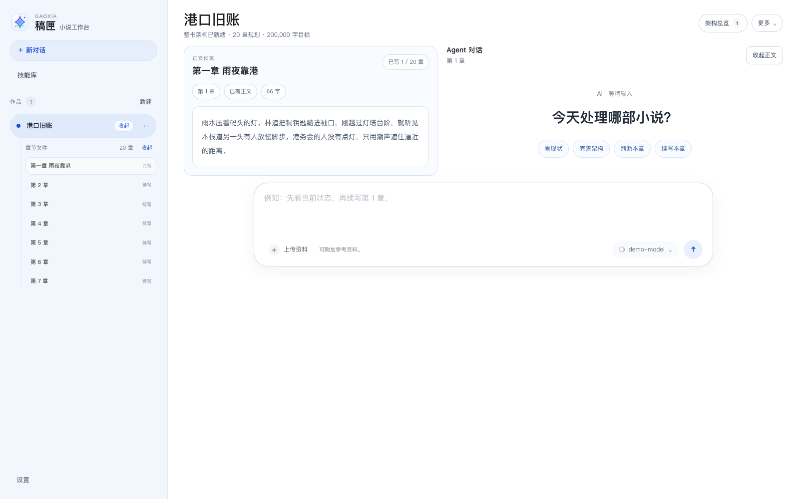
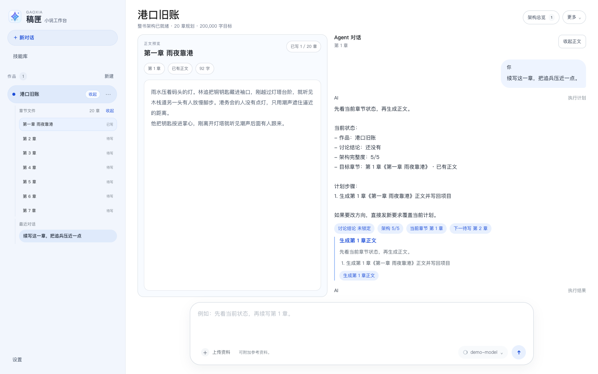
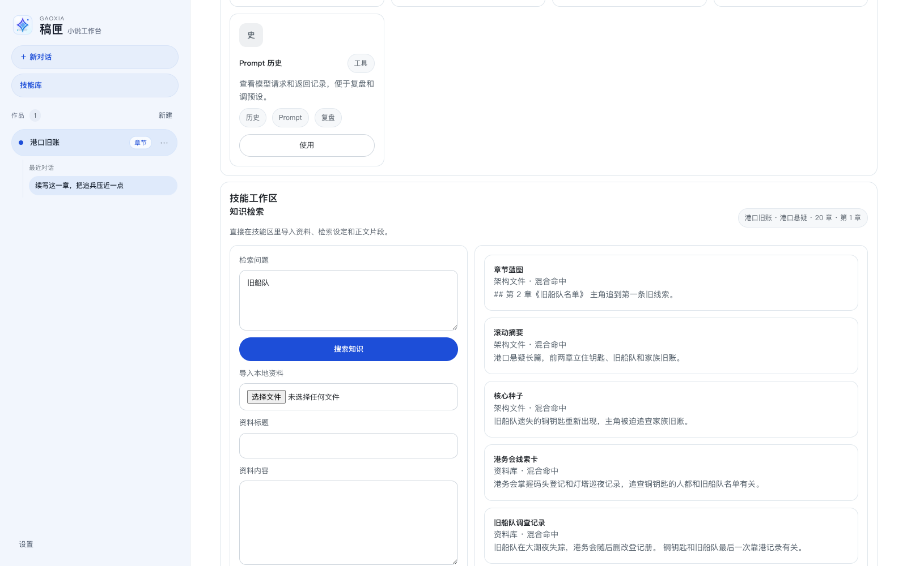
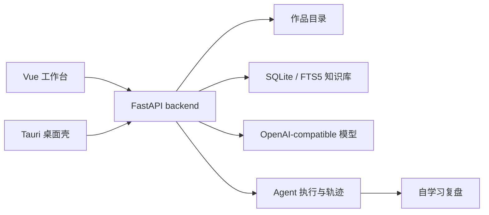

# 稿匣


面向长篇小说创作的本地优先桌面工作台。

`稿匣` 把作品文件夹、章节正文、设定资料、知识检索、模型生成、改稿技能和桌面打包流程放在同一个应用里。它适合需要长期维护世界观、人物线、章节上下文和参考资料的个人作者，也适合作为本地 AI 写作工具的二次开发底座。

[Release](https://github.com/mushroomfk/novel-generator/releases/tag/v0.1.0) · [文档索引](./docs/README.md) · [更新记录](./CHANGELOG.md) · [许可](./LICENSE)

## 桌面截图

### 写作工作台



### Agent 执行流程



### 技能库与知识检索



## 使用流程

1. 创建作品，设置章节数量、目标字数和基础设定。
2. 导入资料、人物卡、参考文本、网页或 PDF，建立本地知识索引。
3. 生成整书架构或章节蓝图，把故事方向沉淀为项目文件。
4. 选中目标章节，在 Agent 对话中提出续写、改稿、资料分析或架构调整请求。
5. 审阅执行计划和生成结果，确认后写回章节正文。
6. 通过本地历史、项目记忆、Prompt 历史和知识检索继续迭代。

## 相对常见 AI 写作工具的优势

| 维度 | 常见做法 | 稿匣 |
| --- | --- | --- |
| 数据位置 | 作品、资料和会话依赖云端项目 | 作品目录、章节、资料库、历史记录和知识索引默认保存在本机 |
| 长篇组织 | 以单次聊天或单篇正文为中心 | 以作品、章节、设定、资料、架构和连续性为中心 |
| 生成过程 | 直接返回一段文本，后续需要手工整理 | 生成前有计划，生成后可预览、审阅、写回和查看历史 |
| 资料使用 | 主要依赖复制粘贴上下文 | 支持导入多格式资料，使用 SQLite / FTS5、embedding 和 rerank 组合检索 |
| 可追踪性 | 难还原一次生成使用了哪些资料和步骤 | Agent 讨论、资料分析、章节写作和整书架构共用执行时间线 |
| 二次开发 | 多数是封闭产品或插件 | 前端、backend、桌面壳和回归脚本都在仓库内，适合继续改造 |

## 为什么值得关注

- 本地优先：作品数据、知识库、版本记录和项目记忆默认保存在本地目录
- 面向长篇：围绕章节、设定、人物、资料、连续性和整书架构组织工作流
- 可审阅生成：模型输出进入计划、执行、预览、写回和本地历史，不只是一段聊天回复
- 资料可检索：导入文本、文档、网页、PDF 后建立 SQLite / FTS5 索引，并支持 embedding 与 rerank
- Agent 有轨迹：讨论、资料分析、章节写作和整书架构共用执行时间线；技能库可查看自学习候选、确认草案、写作回归、模型审查、失败案例、技能版本、技能包和能力看板
- 可二次开发：前端、Python backend、Tauri 壳层和回归脚本都在仓库内

## 适合场景

- 写长篇、连载或系列作品，需要管理章节、设定、资料和版本
- 希望把 AI 写作放进可检查的生产流程
- 需要在本地保存 API Key、作品资料和知识索引
- 想研究或改造一个 `Tauri + Vue + FastAPI` 的本地 AI 应用

## 功能一览

| 模块 | 能力 |
| --- | --- |
| 作品管理 | 创建、重命名、删除作品，打开本地作品目录 |
| 章节工作台 | 编辑正文、自动保存、本地历史、章节概览、章节写回 |
| 故事架构 | 生成整书架构、分步架构、蓝图和项目设定文件 |
| 资料库 | 导入 `txt / md / json / csv / html / docx / pdf`，建立本地索引 |
| 知识检索 | 关键词、embedding、rerank、作者参考库、联网考据 |
| 写作技能 | 人物复刻、去 AI、文风参考、提示词预设、XP 预设、文件浏览、Agent 自学习 |
| Agent 执行 | 讨论、资料分析、章节写作、整书架构、执行轨迹、经验候选、自学习复盘、失败案例库 |
| 桌面运行 | Tauri 自动拉起本地 backend，并把实际 backend 地址下发给前端 |
| 发布回归 | backend 单测、前端构建、浏览器 smoke、桌面 sidecar 打包检查 |

## 技术方案

- 桌面壳：`Tauri 2` 负责窗口、应用元数据、桌面打包和 Python sidecar 拉起
- 前端：`Vue 3 + Vite + TypeScript` 提供作品列表、章节工作台、技能库、设置页和 Agent 对话
- 后端：`FastAPI` 负责项目文件、章节正文、资料导入、模型请求、技能流程和执行状态
- 本地数据：作品文件、章节、设定和历史记录保存在作品目录；资料索引使用 `SQLite / FTS5`
- 模型接入：使用 OpenAI-compatible `chat/completions`，可接入 OpenAI、DashScope、火山方舟等兼容服务
- 检索增强：关键词检索、embedding、rerank 和联网考据可组合使用，适配资料库和作者参考库
- 执行链路：Agent 计划、执行、进度、结果和错误状态通过 backend 统一管理，前端以流式状态展示；任务结束后记录技能使用、调用规则候选、写作评价和失败案例，技能库提供自学习查看、候选确认、写作回归、模型审查、排程配置、后台排程、技能版本回滚、技能包迁移和全局技能提升入口
- 发布验证：仓库保留 backend 单测、前端构建、浏览器 smoke、desktop sidecar 和 Tauri 打包检查脚本



## 项目状态

当前是公开预览版。

- 已可本地运行前端、Python backend 和 Tauri 桌面壳
- 已验证 macOS arm64 调试包和测试分发流程
- 后端单测覆盖项目服务、生成服务、资料导入、许可证、技能流程和记忆系统
- 浏览器层 UI smoke 覆盖建作品、写章节、Agent 计划执行、整书架构和技能检索主链路
- 正式分发仍需要补充 Developer ID 签名、公证、安装包渠道和版本升级策略

## 快速开始

环境要求：

- `Node.js 20+`
- `npm 10+`
- `Python 3.12`
- macOS 桌面打包建议安装 Xcode Command Line Tools

安装依赖：

```bash
npm run deps:install
python3.12 -m venv .venv
. .venv/bin/activate
pip install -e backend
```

启动开发环境：

```bash
npm run dev:all
```

默认地址：

- 前端：`http://127.0.0.1:1420`
- backend：`http://127.0.0.1:18181`
- 健康检查：`http://127.0.0.1:18181/api/app/health`

也可以分开启动：

```bash
npm run backend:dev
npm run dev
```

## 配置模型

复制环境变量示例：

```bash
cp .env.example .env
```

模型调用走 OpenAI-compatible `chat/completions`。API Key 可在应用设置里保存，也可以通过环境变量提供：

- `NOVEL_MODEL_API_KEY`
- `NOVEL_API_KEY`
- `DASHSCOPE_API_KEY`
- `ARK_API_KEY`
- `OPENAI_API_KEY`

Embedding 检索可单独配置：

- `NOVEL_EMBEDDING_API_KEY`
- `DASHSCOPE_API_KEY`
- `ARK_API_KEY`
- `NOVEL_API_KEY`
- `OPENAI_API_KEY`

联网考据使用博查 Web Search API：

- `BOCHA_API_KEY`
- `BOCHA_SEARCH_ENDPOINT`，可选，默认 `https://api.bochaai.com/v1/web-search`

## 常用命令

| 命令 | 用途 |
| --- | --- |
| `npm run dev:all` | 同时启动 backend 和前端 |
| `npm run backend:test` | 运行 Python 单测 |
| `npm run build` | 类型检查并构建前端 |
| `npm run verify` | 执行 backend 单测和前端构建 |
| `npm run verify:ui` | 运行浏览器层 smoke |
| `npm run backend:bundle` | 打包 Python sidecar |
| `npm run verify:desktop` | 检查桌面发布链路 |
| `npm run verify:release` | 执行 UI smoke 和桌面发布检查 |
| `npm run docs:screenshots` | 生成 README 演示截图 |

## 目录结构

```text
.
├── backend/       # Python sidecar 服务源码
├── docs/          # 架构、技能、回归和桌面发布说明
├── scripts/       # 本地构建、回归和打包脚本
├── src/           # Vue 前端
├── src-tauri/     # Tauri 壳层
└── CHANGELOG.md
```

## 文档

- [文档索引](./docs/README.md)
- [桌面版方案](./docs/小说生成器桌面版方案.md)
- [核心引擎说明](./docs/核心引擎说明.md)
- [Agent 执行架构说明](./docs/Agent执行架构说明.md)
- [界面回归说明](./docs/界面回归说明.md)
- [桌面发布回归说明](./docs/桌面发布回归说明.md)

## 路线图

- 补充稳定的桌面安装包发布流程
- 增加更多真实作品规模下的性能样本
- 完善跨章节连续性检查和写回确认体验
- 补充 Windows / Linux 桌面打包验证
- 补充演示视频和更完整的使用教程

## 许可

本项目使用自定义许可，不是 MIT、Apache-2.0 或 GPL。允许个人复制、学习和引用项目内容；引用代码、文档或界面说明时，需要注明项目名称和来源链接。未经授权，不得商用、改名发布或打包分发。第三方依赖仍按各自许可证执行。

完整条款见 [LICENSE](./LICENSE)。

## 参与

欢迎提交 issue 或 pull request。提交前请阅读 [CONTRIBUTING.md](./CONTRIBUTING.md)。安全问题请按 [SECURITY.md](./SECURITY.md) 说明处理。
